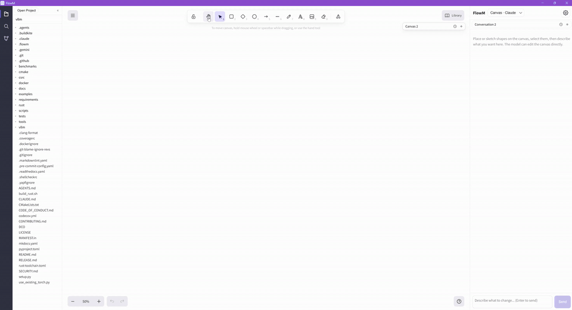
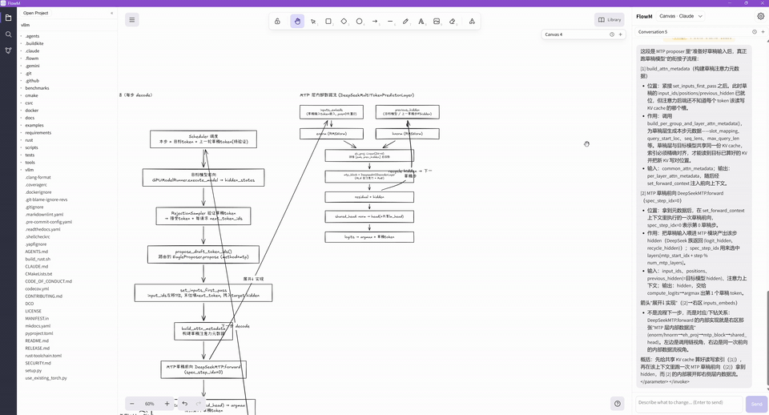
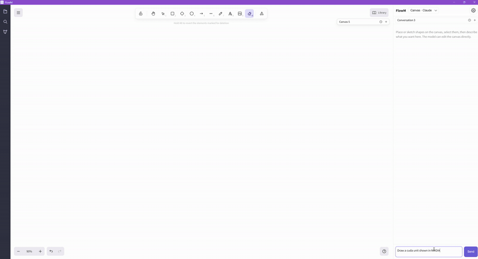
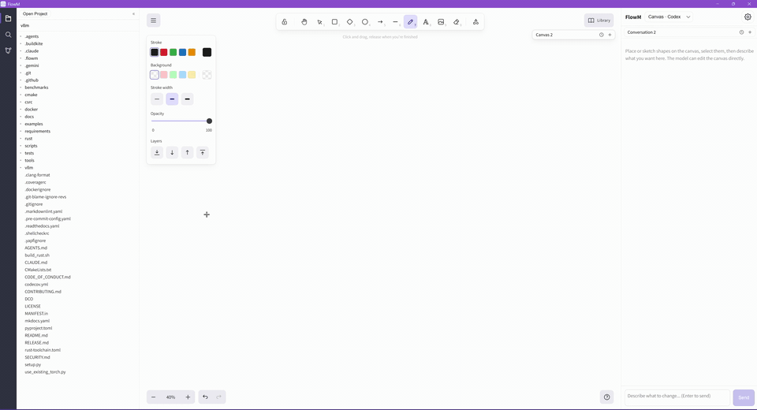
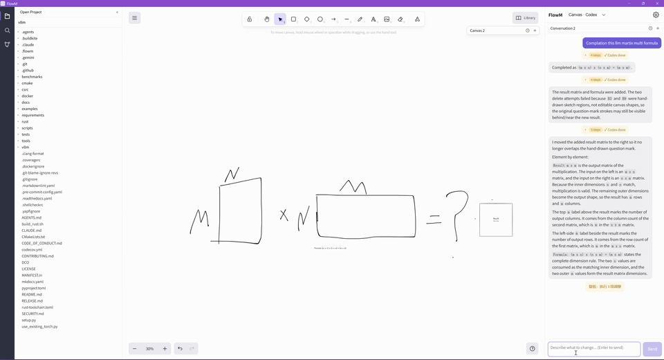

# FlowM

[中文](README.zh-CN.md) | English

FlowM is an AI-native canvas for understanding code, drawing technical diagrams, and turning sketches into project work. It combines an Excalidraw-style infinite canvas with local/code-aware assistants, so you can ask the model to read a repository, explain how something works, draw or refine the diagram directly, and continue from that visual context. FlowM can connect to Claude Code and Codex agents for project-aware local workflows.

The demos below show one continuous workflow: FlowM starts by reading code and generating a diagram, then progressively expands it, understands free-form sketches, and finally uses the canvas context for real project development.

## Demos

### 1. Code-Aware Flowchart

FlowM can inspect project code and generate a flowchart from the actual implementation.



### 2. Sub-Flow From an Existing Flowchart

After a first diagram is created, the assistant can refine a selected area or expand it into a more detailed sub-flow.



### 3. Complex Structure Diagram

FlowM is not limited to linear flows. It can also create architecture and structure diagrams with multiple related regions.



### 4. Free Drawing

You can sketch freely on the canvas, then ask the assistant to interpret, organize, or continue the drawing.



### 5. From Drawing to Project Development

FlowM can use the diagram as context for project-level development work, connecting visual design with code changes.



## Download

Download the latest desktop build from the GitHub Releases page:

<https://github.com/ether-zhang/FlowM/releases>

## Development

Prerequisites:

- Node.js and npm
- Rust toolchain, required for the Tauri desktop app
- Optional local agents such as Claude Code or Codex CLI, if you want project-aware local assistant modes

Install dependencies:

```bash
npm install
```

Run the web dev server:

```bash
npm run dev
```

Run tests and build:

```bash
npm test
npm run build
```

Run the desktop app in development:

```bash
npm run tauri -- dev
```

Build the desktop app:

```bash
npm run tauri -- build
```

## Built With

FlowM is built on top of several major open-source projects:

- [Excalidraw](https://github.com/excalidraw/excalidraw): the canvas, drawing primitives, and export pipeline
- [React](https://react.dev/) and [TypeScript](https://www.typescriptlang.org/): the application UI and typed frontend code
- [Tauri](https://tauri.app/): the desktop shell and native system integration
- [Vite](https://vite.dev/): frontend development and build tooling
- [OpenAI JavaScript SDK](https://github.com/openai/openai-node): OpenAI-compatible API access
- [Zod](https://zod.dev/): runtime validation for canvas operations and protocol data
- [React Markdown](https://github.com/remarkjs/react-markdown) and [remark-gfm](https://github.com/remarkjs/remark-gfm): Markdown rendering in the assistant panel
- [Vitest](https://vitest.dev/): unit testing

## License

FlowM is released under the [MIT License](LICENSE).

## Status

FlowM is still under active development. APIs, UI behavior, agent integrations, and file formats may change before a stable release.

Note: project-level development workflows should be used inside a project directory and currently require Claude Code or Codex to be installed locally. If you only have an API key, you can still use Canvas Assistant API mode for canvas drawing and editing.
