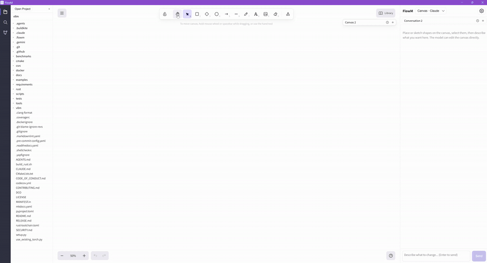
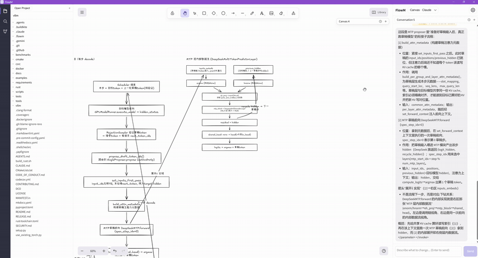
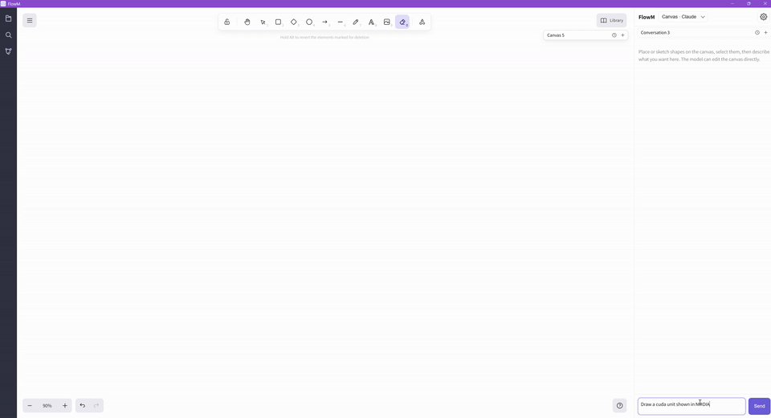
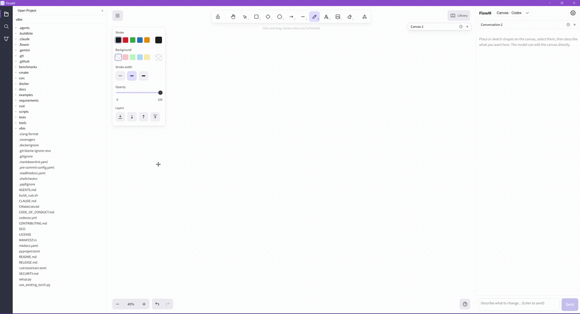
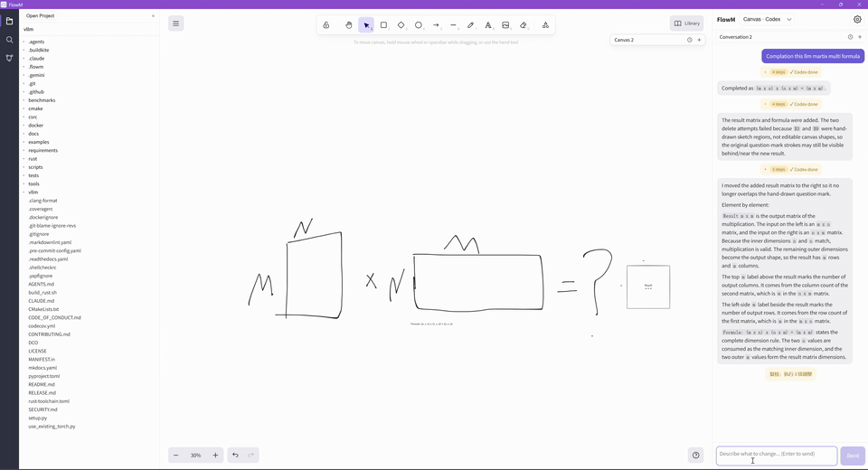

# FlowM

中文 | [English](README.md)

FlowM 是一个面向 AI 协作的画布工具，用来理解代码、绘制技术图、把自由草图推进成工程任务。桌面端自带的 `flowm-harness` 嵌入固定版本的 Codex 内核，连接 OpenAI 或 Responses-compatible gateway，也可由 gateway 路由至 Claude。画布助手以只读权限阅读工程；工程 Agent 使用独立的工作区可写线程，并处理真实审批。

以下演示展示一条连续工作流：FlowM 从读取代码并生成图表开始，逐步扩展、理解自由草图，最终把画布上下文用于实际项目开发。

## 演示

### 1. 理解代码后画流程图

FlowM 可以读取项目代码，并基于真实实现绘制流程图。



### 2. 基于流程图继续画子流程

在已有流程图基础上，助手可以继续细化选中区域，或展开更具体的子流程。



### 3. 更复杂的结构图生成

FlowM 不只适合线性流程，也可以生成包含多个关联区域的架构图和结构图。



### 4. 自由绘画

你可以先在画布上自由绘制，再让助手理解、整理或继续补全。



### 5. 基于画布推进工程开发

FlowM 可以把画布内容作为上下文，继续推进工程开发，把图形设计和代码修改连接起来。



## 下载

请到 GitHub Releases 页面下载最新桌面版本：

<https://github.com/ether-zhang/FlowM/releases>

## 开发

前置要求：

- Node.js 和 npm
- Rust 1.96.0，以及对应平台的 Tauri 构建依赖

FlowM 仅支持桌面应用。所有模型连接统一经过随包 harness，不使用已安装的 Codex/Claude executable 或它们的凭据。开发中的 Vite 服务用于桌面 webview，不再提供独立浏览器应用。

安装依赖：

```bash
git submodule update --init --recursive
npm install
```

`third_party/codex` 是关联官方 `openai/codex` 的 submodule，固定在
`third_party/codex-source.json` 记录的已验证提交。新克隆可使用
`git clone --recurse-submodules`。普通子模块更新使用 FlowM 记录的提交，
不会自动跟随上游 HEAD。

需要单独开发界面时，启动前端开发服务：

```bash
npm run dev
```

运行测试与构建：

```bash
npm test
npm run build
```

启动桌面端开发模式：

```bash
npm run tauri -- dev
```

构建桌面应用：

```bash
npm run tauri -- build
```

桌面端开发与构建会先编译固定版本 harness，再随应用打包。单独构建或检查运行时：

```bash
npm run harness:build
npm run harness:test
```

集成检查使用本地模拟 Responses 服务和临时工程，不发起付费模型调用。Windows 应在普通宿主终端运行；已有受限进程中的嵌套沙箱可能无法创建测试用的 Windows 令牌。

在设置中通过 **GPT 登录** 完成 ChatGPT 授权，或通过 **Gateway** 配置 Responses-compatible 接口（`https://your-gateway/v1`、可选 bearer token）。模型只能从 harness 返回的候选列表选择；GPT 登录包含官方内核候选并标明访问待确认，Gateway 只使用自己的实时目录；网关须同时提供 `GET /v1/models` 和 `POST /v1/responses`。OpenAI API Key 也通过 Gateway 使用，地址为 `https://api.openai.com/v1`。Claude 账号直接登录尚未实现，可通过 Gateway 路由到 Claude 模型。同一时间启用一个连接，旁边显示退出登录按钮。认证由原生 harness 管理。原有 FlowM 对话、画布文件和 `.flowm.json` 导入导出继续保留，旧 CLI ID 仅作为历史引用。以可见 FlowM 对话作为继续工作的上下文，模型会话统一保存在 FlowM 私有运行时中。实现进度和验收记录见[方案文档](docs/flowm-harness-mvp.md)。

## 主要开源项目

FlowM 基于多个重要开源项目构建：

- [Excalidraw](https://github.com/excalidraw/excalidraw)：画布、绘图基础能力和导出流程
- [React](https://react.dev/) 和 [TypeScript](https://www.typescriptlang.org/)：应用界面和类型化前端代码
- [Tauri](https://tauri.app/)：桌面外壳和原生系统集成
- [Codex](https://github.com/openai/codex)：固定版本的 agent 内核、工具执行和沙箱；保留 Apache-2.0 许可证与 NOTICE
- [Vite](https://vite.dev/)：前端开发和构建工具
- [Zod](https://zod.dev/)：画布操作和协议数据的运行时校验
- [React Markdown](https://github.com/remarkjs/react-markdown) 和 [remark-gfm](https://github.com/remarkjs/remark-gfm)：助手面板中的 Markdown 渲染
- [Vitest](https://vitest.dev/)：单元测试

## 许可证

FlowM 使用 [MIT License](LICENSE) 开源。

## 项目状态

FlowM 仍在持续开发中。稳定版本发布前，API、界面行为、Agent 集成方式和文件格式都可能继续调整。

首版 harness 已在 Windows 通过本地内核、权限、恢复和输出契约检查。真实 ChatGPT 授权、具体 gateway/Claude 路由、新机器安装及 macOS/Linux 验收仍是发布前待完成项；本地模拟测试不证明这些结果。
