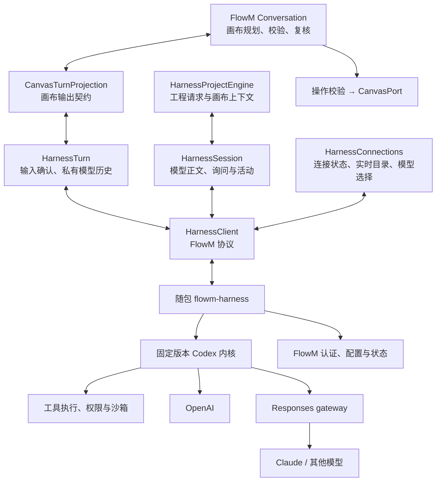

# FlowM Harness MVP 设计与验收

日期：2026-10-02。状态：主体实现和 Windows 离线内核集成已完成；真实认证、具体 gateway 路由及新机器发布验收尚未完成。

本文定义 FlowM 自带 agent 运行时的首版范围、架构边界、迁移步骤和验收条件。目标是让 FlowM 在没有安装 Codex CLI 或 Claude Code 的机器上，完成现有的项目理解、画布绘制和工程开发工作流，并由 FlowM 管理模型认证、会话、工具执行与权限。

首版采用固定版本的 `flowm-harness` 随包服务进程，通过 `codex-core-api` 嵌入 Codex 内核，支持 OpenAI 和 Responses-compatible gateway。画布业务继续由 FlowM 的 `Conversation`、输出契约和 `CanvasPort` 管理。后续根据构建结果裁剪依赖，并保留增加原生模型协议的边界。

正式替换采用单一路径：删除旧 Claude/Codex CLI 执行、控制客户端、路径发现与 fallback，不保留“旧 CLI 高级模式”。向后兼容针对用户数据和任务历史，不要求继续执行旧程序。新 harness 尚未可用前不删除唯一仍在工作的实现；它们只用于替换期间的开发对照，最终发行物不得保留执行入口。

当前已实现 `harness/`、`src/harness/`、CanvasTurnProjection + HarnessTurn、HarnessProjectEngine、认证/配置 UI 和 Tauri 随包进程监督；旧 CLI 执行、路径发现、控制协议与 fallback 已移除。以下要求仍是完整 MVP 的验收标准，不因为代码已接入就全部标记为通过。

## 当前实现与验证记录

本轮使用 Rust 1.96.0、Codex SHA `67727e7cf114cf3e1b71db368d74b24e32f6cb12` 和锁文件构建。`third_party/codex` 现以官方 `openai/codex` 的 Git submodule 管理，gitlink 固定到该 SHA，没有本地内容修改；尚未做深度依赖裁剪。它不是跟随上游分支自动更新的依赖。

| 项目 | 当前证据与限制 |
| --- | --- |
| 内核嵌入 | FlowM 自有 binary 已独立编译、链接并运行，直接使用 core-api；不启动环境 app-server/CLI。 |
| 模型请求 | 真实内核对本地模拟 `/v1/responses` 完成 schema 切换、工具循环和最终输出；真实云端请求待验收。 |
| Windows 权限 | 宿主环境中只读命令读取成功，命令写工程被拒绝；workspace-write 可写；越界审批批准前不执行，拒绝后不执行，批准后执行。 |
| 恢复与故障 | 已验证私有历史冷恢复、完成回执去重、认证错误不重放、取消，以及中断线程在重新打开后仍被阻断。 |
| 旧数据 | 旧 session 字段和 UI/scene 文件保留；新绑定按 profile/凭据版本/角色/模型区分。显式 JSONL 导入幂等、保留原文件、导入过程不提交 turn，之后从私有 fork 继续。 |
| 认证存储 | 已验证测试 bearer 请求、加密文件和退出删除。OS 凭据库保存每个 profile 的 32 字节加密密钥；OAuth 记录在 FlowM 私有目录 AES-256-GCM 加密、原子写入。真实 OAuth、刷新和重启后的真实推理待验收。 |
| 官方登录 | 原生 PKCE/state/nonce、动态 client 注册、ID token/JWKS 校验、plan scope 校验、刷新和退出已实现；SIWC 请求桥将工具分组、保留显式历史、移除不支持字段。没有执行真实浏览器授权。 |
| 进程监督 | Tauri 使用已知随包路径、有限队列和退出确认；Windows Job Object 关闭后父子进程均结束的测试通过。首版选择 unelevated backend，其 helper 由主 binary 隐藏入口执行。 |
| 前端 | 26 个文件、179 项测试通过，TypeScript/Vite 构建通过；删除了旧 CLI 专属测试，输出契约和画布领域测试保留。新增/迁移的独立模块通过定向 lint；全量 lint 仍有未改动 UI 文件的 6 项既有错误。 |
| 受保护边界 | 相对迁移基线，`src/protocol`、`src/canvas` 无内容改动。Conversation 增加取消转发及调用前后检查，阻止取消后的迟到结果落图；build/review/finalize 及领域校验保持。 |

发布版运行时已经编译并通过同一套宿主集成测试：20 次本地 Responses 请求，使用 `claude-offline-fixture` 别名覆盖未知 gateway 模型装配。`x86_64-pc-windows-msvc` 发布版主 binary 约 160 MiB，仍包含完整 core 的较大依赖图；这一体积记录不表示精简裁剪完成。Tauri 桌面应用的 debug/不生成安装包构建已完成，产物为 `src-tauri/target/debug/flowm.exe`。Installer 与新机器验证没有执行。

测试入口：`npm test`、`npm run build`、`cargo test --locked --offline --manifest-path src-tauri/Cargo.toml`、在 `harness` 中运行 `cargo +stable test --locked --offline`、`npm run harness:test`。Windows 的真实沙箱集成应在普通宿主终端运行；外层受限令牌会导致嵌套 CreateRestrictedToken 失败。它使用临时工程和模拟模型，不发起付费推理。测试证据保存在 gitignored 的 `tmp/harness-integration-*`。

当前只可将 G0–G2 的 Windows 离线内核路径记为通过；G3 和完整的十二项发布验收保持待验证。未指定 gateway 的上下文窗口不被当成 OpenAI fallback 窗口使用。尚未实现所有故障场景的恢复，不能承诺外部副作用 exactly-once，也不能把本轮结果称为完成了“精简抽取”。

## 目标和完成定义

首版必须解决四个现有问题：

1. 模型调用依赖机器上碰巧安装的 CLI、版本、登录状态和配置。
2. 画布助手与工程开发模式使用不同的进程调用和事件解析路径。
3. 请求失败、取消、会话恢复和凭据刷新缺少一致的处理契约。
4. 权限标识与实际执行边界可能不一致，尤其是 Windows 下的只读模式。

本项目分别验收两个目标：

| 目标 | 完成依据 |
| --- | --- |
| 独立交付运行时 MVP | 新机器可运行，认证与配置隔离，两类权限线程可用，OpenAI 与 gateway 通过完整流程及故障测试。 |
| 精简抽取内核 | 有明确的复用模块、依赖与资源清单，可重复构建，完成依赖裁剪及包体积测量。 |

独立交付可以先于深度裁剪完成。随包分发完整内核也可能通过功能验收，因此不能仅凭运行成功就宣称完成了精简抽取。

## 分析依据和现有边界

重构前分析基于 FlowM 收尾提交 `b792d234751aa6a78d479f2522b90e5872241448` 和本地 `D:/Project/codex` 的 `67727e7cf114cf3e1b71db368d74b24e32f6cb12`。下列旧实现评审描述这一历史基线，相关 CLI 文件在本轮替换后已删除；当前进度以本文开头的实现记录为准。固定源码位于 `third_party/codex` 子模块。

| 现有模块 | 职责 | 迁移处理 |
| --- | --- | --- |
| [Conversation](../src/llm/conversation.ts) | build、review、finalize，操作校验、符号引用、复核范围和最终说明。 | 保留业务所有权。 |
| [CanvasTurnRuntime](../src/llm/canvasTurn.ts) | 接收业务请求，返回中立的 `LlmTurn`，提供询问和生命周期接口。 | 增加 harness 实现。 |
| [输出契约](../src/llm/outputContract.ts) | 生成 portable、strict schema，并投影为同一个 `LlmTurn`。 | 继续由 FlowM 维护。 |
| [CanvasPort](../src/protocol/port.ts) 与 [画布实现](../src/canvas/excalidrawPort.ts) | 应用经过校验的画布操作与布局意图。 | 保留。 |
| [CodexAdapter](https://github.com/ether-zhang/FlowM/blob/b792d234751aa6a78d479f2522b90e5872241448/src/llm/codexAdapter.ts) 与 [Codex 客户端](https://github.com/ether-zhang/FlowM/blob/b792d234751aa6a78d479f2522b90e5872241448/src/agentControl/codexAppServer.ts) | 已使用 app-server JSON-RPC；增加超时、输出保护、失败后重新启动和发送游标保护。 | 保留已验证的行为与测试，迁移到 FlowM 协议；不再把这些问题列成完全未处理。 |
| [ClaudeAdapter](https://github.com/ether-zhang/FlowM/blob/b792d234751aa6a78d479f2522b90e5872241448/src/llm/claudeAdapter.ts) 与 [兼容 transport](https://github.com/ether-zhang/FlowM/blob/b792d234751aa6a78d479f2522b90e5872241448/src/llm/claudeTransport.ts) | Claude 控制协议及一次性 CLI 兼容路径。 | 正式替换后删除两条执行路径，只迁移旧用户数据和可用历史。 |
| [CodexEngine](https://github.com/ether-zhang/FlowM/blob/b792d234751aa6a78d479f2522b90e5872241448/src/engine/codexEngine.ts) 与 [ClaudeEngine](https://github.com/ether-zhang/FlowM/blob/b792d234751aa6a78d479f2522b90e5872241448/src/engine/claudeEngine.ts) | 旧工程执行代码仍通过 CLI；当前 App 已从可选引擎中隐藏这两条路径。 | 新 Project Agent 需要明确入口、权限和事件流程，不能按已有完整产品入口直接替换。 |
| [模型发现](https://github.com/ether-zhang/FlowM/blob/b792d234751aa6a78d479f2522b90e5872241448/src-tauri/src/model_catalog.rs) | 启动环境 CLI 查询模型目录。 | 改为查询 harness，不启动环境 CLI。 |
| [Workspace](../src/workspace/useWorkspace.ts) 与 [会话元数据](../src/workspace/types.ts) | 每个项目、FlowM 会话和 provider 的运行时与恢复句柄。 | 增加独立的 harness 会话绑定，兼容读取旧字段。 |

2026-10-01 的本轮验证结果为 32 个前端测试文件、212 项测试通过，TypeScript 构建检查通过；`cargo test --locked --offline --manifest-path src-tauri/Cargo.toml` 编译通过，但实际执行 0 项 Rust 测试。前端测试覆盖现有架构、画布行为、模型选择和临时运行时保护，不证明真实登录、沙箱、进程树退出或新 harness 已经可用。

### 收尾版本评审结果

| 优先级 | 当前事实 | 对方案的修正 |
| --- | --- | --- |
| P1 | [Windows 沙箱选择](../src-tauri/src/lib.rs)仍无条件返回 `danger-full-access`；Claude 控制路径提供交互审批，但没有工程只读的硬上限，legacy 路径还使用 `bypassPermissions`。 | Canvas profile 必须在执行层保持只读；不能直接沿用现有启动参数或以审批替代只读边界。 |
| P1 | [画布和会话切换](../src/workspace/useWorkspace.ts)没有运行中保护；[PickerBar](../src/workspace/PickerBar.tsx)不接收 busy 状态，`Conversation` 使用会被切换场景的同一个 CanvasPort。 | 每轮捕获项目、会话、画布和视图代次；切换前结束旧请求，应用结果前校验归属，询问回答路由至原请求。 |
| P2 | [进程控制](https://github.com/ether-zhang/FlowM/blob/b792d234751aa6a78d479f2522b90e5872241448/src-tauri/src/agent_control.rs)已增加 `kill_on_drop` 和停止信号，停止会显式 kill 主进程；stdout、stderr 和命令队列仍是无界通道。 | 保留主进程终止能力，再验证进程树、读取任务收尾、关闭确认和背压；不能宣称已解决全部生命周期问题。 |
| P2 | [ClaudeAdapter](https://github.com/ether-zhang/FlowM/blob/b792d234751aa6a78d479f2522b90e5872241448/src/llm/claudeAdapter.ts)仍在完成请求前推进发送游标；schema 仅在 transport 创建时设置，缓存键不包含 phase 或 schema，缺失结构化结果仍主要记录警告。 | 新 adapter 对每轮 schema 和确认状态独立处理，错误明确失败；不能把 Codex 临时修复当成所有 provider 的共同保证。 |
| P2 | [Codex 客户端](https://github.com/ether-zhang/FlowM/blob/b792d234751aa6a78d479f2522b90e5872241448/src/agentControl/codexAppServer.ts)仍以单个 activeTurn 接收事件，并固定发送 `effort: medium` 与 `summary: detailed`。 | 共享客户端按线程、turn 和连接代次路由；推理参数按模型能力选择，不能直接迁移硬编码。 |

上述为静态评审发现与迁移要求，不表示本轮已经修复应用源码。

## 首版范围

首版提供 OpenAI API Key、浏览器中的官方 ChatGPT 授权，以及 gateway 的无认证或 bearer 凭据。Gateway 使用 `/v1/responses`，可由 gateway 路由至 Claude 或其他模型；必须实测具体 gateway 与模型组合。

首版包括会话持久化、线程与 turn 生命周期、模型请求和流式事件、工具循环、图片输入、结构化输出、上下文管理、项目读取、工程编辑和命令执行，以及真实的权限询问和沙箱。

原生 Anthropic Messages、其他原生模型协议和完整 gateway OAuth 不作为首版完成条件。应用连接、插件市场、语音、实时交互、云任务、记忆系统、多 agent、自动审批审核器和遥测产品功能不纳入首版对外能力。本地 MCP 可在明确工作流需要时增加，不自动继承用户现有 Codex 或 Claude 的 MCP 配置。

旧 CLI 不作为失败后的降级选择，也不为兼容 session 而启动。产品现仅支持桌面端，独立 HTTP/API 模式、浏览器运行模式与旧 API 凭据代理已移除；模型连接统一经过 harness。桌面端仍保留原有 `.flowm.json` 导入导出及旧对话、画布数据兼容。

浏览器授权属于 MVP 完成条件。可以先用 API Key 验证内核和请求，但 API Key 路径成功不能代替浏览器登录验收。

## 架构和职责



`Conversation` 控制画布工作的外层循环：决定本轮允许的操作、执行校验、应用操作、限定复核范围，并生成最终说明。Harness 控制一次请求内部的项目工具循环、模型上下文、询问与生命周期。保留这些业务职责不意味着冻结所有接口；迁移需要在调用边界补充取消、上下文归属与输入确认，避免重写画布语义和布局算法。

画布请求中的 harness 返回 `{ reply, question, operations }` 结构化结果。它不直接调用 `CanvasPort`，不解释 `declare_diagram`、`create_geo`、`place_region` 等画布语义。首版不把画布操作注册为可随时执行的内核工具，避免改变现有批次校验和复核权限。

画布模式由 `CanvasTurnProjection` 连接 `HarnessTurn`，继续返回 `LlmTurn`。工程模式由 `HarnessProjectEngine` 准备业务上下文，交给 `HarnessSession` 处理模型正文、工具活动、权限询问和完成事件。两条路径由同一个 `HarnessClient` 承载；engine 和 workspace 不直接调用原生模型协议。

UI 翻译和显示语言保持在 UI 层。FlowM 保留唯一的画布语义指令，provider 差异仅处理请求编码、schema 方言和运行时能力，不产生按模型分叉的绘图规则。

本次重构把 `src/protocol` 和 `src/canvas` 作为受保护边界，首版默认不改其实现或 CanvasPort 接口。取消、上下文归属和会话切换保护在 engine、workspace、adapter 或调用代理中完成；格式差异在 outputContract 或 adapter 消化。任何确需突破这一边界的改动应先给出独立原因与范围，不能因更换模型运行时顺带修改布局和形状语义。

## Codex 嵌入和裁剪

本地 checkout 确实包含 [codex-core-api](https://github.com/openai/codex/blob/67727e7cf114cf3e1b71db368d74b24e32f6cb12/codex-rs/core-api/src/lib.rs) 和 [thread-manager-sample](https://github.com/openai/codex/blob/67727e7cf114cf3e1b71db368d74b24e32f6cb12/codex-rs/thread-manager-sample/src/main.rs)。示例展示了直接构造 `ThreadManager`、提交 turn 并关闭线程的路径。因此首版继续采用 core-api 嵌入方案，不先重写完整 agent loop，也不依赖外部 app-server executable。

### 本地源码核对和装配方案

| 源码入口 | 已确认的能力和限制 | 首版采用方式 |
| --- | --- | --- |
| `core-api` 与线程管理示例 | facade 和直接嵌入入口存在；facade 仍传递依赖完整 core。 | 作为固定版本内核适配边界，先完成可运行服务，再做依赖裁剪。 |
| `thread-manager-sample/src/main.rs` | 示例是一次性程序；寻找 Codex home、读取认证配置、注册图片生成扩展、使用默认 features；权限为 read-only 加 `AskForApproval::Never`。 | 只借鉴装配顺序，不将示例复制成服务，也不继承其认证与审批策略。 |
| `core/src/thread_manager.rs` | 一个 ThreadManager 持有共享的 AuthManager、模型管理器及执行环境；创建时仍会装配 skills、plugins、MCP 等服务。 | 侧重按 profile 与凭据隔离运行时，禁用对外能力；空 extension registry 不等于移除所有内置依赖。 |
| `config/src/state.rs` 与 core Config | 有显式 home、user config 路径及忽略用户、项目配置的 loader 选项。 | 建立 KernelConfigAssembler，使用 FlowM 配置和明确的 loader 策略；不调用默认 home 发现。 |
| `login/src/auth/manager.rs` 与 `auth_headers.rs` | ExternalAuth 支持 resolve、refresh，AuthHeaders 可由宿主持有，且 Debug 输出脱敏。 | 建立 FlowM 认证桥，复用内核请求处理；官方注册、持久化及刷新仍由 FlowM 管理并验证。 |
| `protocol/src/turn_input.rs` 与 CodexThread | 支持 start_turn_if_idle，每轮 final_output_json_schema；Started 仅表示接收处理，不代表已经持久化或完成推理。 | 分阶段创建 turn，明确忙状态与输入回执；外层保存自己的请求记录，不依赖内核隐含幂等。 |
| `ext/extension-api/src/tool_policy.rs` | 启动时捕获工具上限；默认 allowed_tools 为 None，额外权限参数可见；恢复时需重新提供策略。 | 显式工具白名单、只读上限和审批规则；恢复时重新安装策略并校验角色。 |
| `exec-server/src/runtime_options.rs` 与 arg0 | 执行器需要绝对路径的 codex_self_exe，用于隐藏的执行、文件及补丁入口。 | 服务处理这些入口，或分发专用执行器；路径指向 FlowM 自带资源。 |
| `windows-sandbox-rs/Cargo.toml` | 有单独的 setup、command runner 及 managed deny probe binary。 | 形成实际沙箱后端对应的 helper 清单，在干净 Windows 环境验证，不仅检查主服务存在。 |

上游源码采用 Rust 2024 edition，其工具链文件为 1.95.0。FlowM 独立构建使用并校验 Rust 1.96.0，使用自己的 Cargo.lock；已经完成嵌入 binary 构建及 FlowM-owned 测试，没有执行上游完整 workspace 的测试集。

建议的后端装配由四个 FlowM-owned 组件承担：KernelConfigAssembler 接收 profile 和权限要求；CredentialStore 与 AuthDriver 管理 secret；RuntimeRegistry 管理内核实例与线程；EventRouter 将内核事件映射为 FlowM 协议。上游类型限制在这些后端实现内。

首次装配须显式处理 feature 和 extension，而不是采用 `Features::with_defaults()` 后仅隐藏 UI。当前源码中 Apps、Plugins 与 CodeModeHost 默认开启；CodeModeHost 的关闭策略、图片生成扩展、MCP 和其他能力需要逐项检查实际模型工具和启动路径。首版可使用明确的工具上限和不启用的扩展，但编译依赖是否因此变小仍需测量。

已有的 [ToolPolicy](https://github.com/openai/codex/blob/67727e7cf114cf3e1b71db368d74b24e32f6cb12/codex-rs/ext/extension-api/src/tool_policy.rs)只限制工具选择，不能代替沙箱。Canvas 角色须同时约束工具、文件与进程权限；不能单靠禁用 Write、Edit 名称就允许任意 shell 命令写工程。

`core-api` 是公共 facade，其 [Cargo 依赖](https://github.com/openai/codex/blob/67727e7cf114cf3e1b71db368d74b24e32f6cb12/codex-rs/core-api/Cargo.toml)仍包含 `codex-core`、配置、认证、执行环境、历史、模型目录等模块。关闭运行时功能不等于删除编译依赖；示例也不能直接证明精简包的体积。

首版先封装经过验证的内核入口，建立 FlowM 自己的协议、配置和认证边界。裁剪依据实际依赖图与构建结果进行，避免同时重写工具循环、会话、认证和沙箱。

| 能力 | 处理方式 |
| --- | --- |
| ThreadManager、工具循环、历史恢复、上下文管理 | 首版通过内核复用，对外接口由 FlowM 控制。 |
| 文件与进程执行、补丁、权限和沙箱 | 复用适用组件，并完成资源分发与跨平台测试。 |
| 模型与凭据绑定 | FlowM 管理 profile，Codex 类型限制在内核适配实现内。 |
| Apps、插件市场、语音、多 agent 等 | 对外禁用；进一步是否可从构建中排除，逐项验证。 |

执行组件可能通过自身可执行文件的特殊入口或随包辅助程序运行。[示例](https://github.com/openai/codex/blob/67727e7cf114cf3e1b71db368d74b24e32f6cb12/codex-rs/thread-manager-sample/src/main.rs)使用 `ExecServerRuntimeOptions`，[arg0 实现](https://github.com/openai/codex/blob/67727e7cf114cf3e1b71db368d74b24e32f6cb12/codex-rs/arg0/src/lib.rs)提供执行、文件、补丁与沙箱相关入口。因此，“不调用环境 Codex”允许调用 FlowM 随包、自行管理的辅助程序，不能假设只链接一个 crate 就获得完整执行环境。

复用源码必须固定 commit，并保留适用的 LICENSE、NOTICE 与来源记录。升级内核必须经过构建、协议和行为测试，不能跟随 floating branch 自动更新。

## 认证和配置隔离

供应商身份、请求协议、认证方式和模型选择分别建模。一个凭据可以服务多个经授权的模型路由；一个线程始终绑定到明确的 provider profile 与 credential reference。

建议使用 FlowM 自己的应用数据目录保存 harness 配置和状态，例如 `~/.flowm/harness/`。平台路径由原生后端解析。凭据优先进入 OS keyring，配置仅保存凭据引用；keyring 不可用时必须明确报告，不能静默把 secret 写入普通配置文件。

KernelConfigAssembler 应显式设置 FlowM-owned home、配置路径和 profile，关闭外部用户、项目模型配置及外部规则的自动继承，同时保留适用的主机强制要求。上游 [LoaderOverrides](https://github.com/openai/codex/blob/67727e7cf114cf3e1b71db368d74b24e32f6cb12/codex-rs/config/src/state.rs)提供相关选项。不能采用仅供测试的“忽略所有 managed requirements”方法作为产品隔离方案。

隔离范围包含配置、凭据命名空间、日志、会话、模型缓存和自动发现。不得通过系统 `~/.codex`、既有 Codex keyring 条目或环境 CLI 补齐缺失配置。内核以显式配置启动，不依赖用户全局环境变量决定其 home。用户选定项目内的指令文件按既有项目规则读取。

唯一的数据迁移例外是用户明确发起的一次性历史导入：可以读取用户指定的旧会话导出或对应历史文件，复制到 FlowM 私有存储后处理。不得自动扫描或继续依赖系统目录，不读取旧 auth/config，也不向原始历史追加记录。导入结束后的正常运行仍完全隔离。

模型请求凭据不自动注入工程工具的子进程环境。普通项目读取工具不能暴露 harness 的私有认证目录；返回给模型、前端和日志的工具结果需要遵守同一凭据隔离要求。

### OpenAI 授权

OpenAI 的 API Key 与 ChatGPT 计划额度是两种认证路径。浏览器授权采用适用于 FlowM 的官方流程，不把 Codex 的现成 client ID、登录参数与 FlowM 自己的授权身份视为等价。

可复用 PKCE、回调、存储与刷新等组件，但需要验证应用注册、host ID、scope、账户及 workspace 绑定。官方开源应用流程要求保存所授予的 client ID 和稳定的 host ID，并验证授权结果。[官方注册流程](https://developers.openai.com/siwc/token-sharing-open-source/sign-in)

本地 [Codex 登录服务](https://github.com/openai/codex/blob/67727e7cf114cf3e1b71db368d74b24e32f6cb12/codex-rs/login/src/server.rs)仍使用 Codex 的授权入口和 connectors scope；它不等于 FlowM 的动态注册流程。建议由 FlowM AuthDriver 完成官方流程，再通过 [ExternalAuth](https://github.com/openai/codex/blob/67727e7cf114cf3e1b71db368d74b24e32f6cb12/codex-rs/login/src/auth/manager.rs)和 [AuthHeaders](https://github.com/openai/codex/blob/67727e7cf114cf3e1b71db368d74b24e32f6cb12/codex-rs/login/src/auth/auth_headers.rs)桥接内核。源码已有对应集成测试作为设计依据，但本轮未运行；仍须验证 FlowM 凭据、刷新和请求权限与这条桥接路径相容。

ChatGPT 计划额度请求有独立限制，包括 HTTP 下的 `store: false`、`stream: true`、显式历史输入，以及不同的工具和参数支持。Provider 必须按认证模式构造请求，不能仅替换 Authorization 后沿用普通 API 请求。[官方请求限制](https://developers.openai.com/siwc/token-sharing-open-source/preview-limitations)

浏览器回调、token 交换、刷新和存储由原生 harness 完成。前端只获得公开账户信息、认证状态和失败原因，不获得 access token 或 refresh token。用户手动输入 API Key 或 gateway bearer token 时，输入仅用于提交原生后端，前端不持久化、不记录日志，也不读取已保存 secret 的原值。

认证状态至少区分未配置、授权中、已授权、需要重新授权和失败。模型目录与登录成功不证明某个模型当前可用；一次成功的真实推理是该次访问成功的依据。[官方接入概览](https://developers.openai.com/siwc/token-sharing-open-source)

### Gateway 凭据

首版支持 `none` 和 `bearer`。Profile 保存 `baseUrl`、模型偏好、协议类型和 credential reference；bearer token 进入原生 secret store。设置只输入 URL 与凭据，模型从 gateway 实时返回的目录选择。Gateway 请求不得自动混入 OpenAI 用户凭据。

本地 [provider 认证](https://github.com/openai/codex/blob/67727e7cf114cf3e1b71db368d74b24e32f6cb12/codex-rs/model-provider/src/auth.rs)会区分显式 provider 凭据和 ambient auth；配置为不要求 OpenAI 认证的自定义 provider 不会自动获得 AuthManager 的 headers。Gateway 认证必须在 provider 级明确装配，不能只设置一个全局登录对象。内存中的 credential 传递方式也要验证不会将明文写入配置、rollout、IPC 或日志。

Gateway OAuth 留作后续能力。Claude 经 gateway 推理使用的是 FlowM 所选内核的工具、权限和会话语义，Claude Code 的 hooks、插件与原生 session 不会仅因为底层模型仍是 Claude 而自动迁移。

未来的原生 Claude API 请求与 Claude.ai 订阅登录需要分别实现。当前官方要求第三方产品提供 Claude.ai 登录或额度前获得批准；该登录不作为本 MVP 的承诺。[Claude Agent SDK 说明](https://code.claude.com/docs/en/agent-sdk/overview)

### 刷新和退出

同一 credential 的刷新应串行协调，避免并发刷新覆盖有效凭据。401 可触发受限的认证恢复；额度耗尽、模型不可用和普通请求失败应分别报告，不统一当成需要重新登录。

退出登录由 harness 执行：禁止该 credential 的新请求，取消相关活动 turn，清理 FlowM 保存的凭据及内存认证状态，并同步前端。退出不删除画布与项目历史，不修改其他应用的登录状态。

## 模型能力和 Gateway 契约

首个内核后端使用 Responses。上游 [WireApi](https://github.com/openai/codex/blob/67727e7cf114cf3e1b71db368d74b24e32f6cb12/codex-rs/model-provider-info/src/lib.rs)当前只有 `Responses`，并拒绝 `wire_api="chat"`。Gateway 仅宣称兼容 OpenAI Chat Completions，不能作为这一路径可用的依据。

LiteLLM 有公开的 [Codex 接入示例](https://docs.litellm.ai/docs/proxy/client_setup/codex_cli)和 [Responses 转换说明](https://docs.litellm.ai/docs/response_api)，可以作为首个验证对象。该文档依据不代替 FlowM 的完整流程实测。

每个 provider 和模型组合必须明确以下能力：

| 能力 | 验证要求 |
| --- | --- |
| 流式响应 | 完成、失败、中断及工具参数事件有明确边界，不能静默截断后报告成功。 |
| 工具调用 | 实际启用的 function、namespace、custom 工具形态能完成调用及结果回传。 |
| 结构化输出 | 能承载 FlowM 当前输出 schema，缺失或不合法结果明确失败。 |
| 图片 | 画布与复核图片真实传入支持视觉的模型，不静默忽略。 |
| 上下文 | 模型窗口、预算和压缩策略按实际能力配置。 |
| 模型目录 | 返回实际路由或明确报告目录不可用；不伪造可用模型与权限。 |

Codex 对未知模型可能使用 [默认元数据](https://github.com/openai/codex/blob/67727e7cf114cf3e1b71db368d74b24e32f6cb12/codex-rs/models-manager/src/model_info.rs)。不能据此推定 Claude 路由的上下文窗口、reasoning 参数、工具形态或视觉支持。

模型目录由 harness 统一装配。请求复用 Codex `ModelsClient`，ChatGPT 公共目录读取 `models[].slug` 与 `visibility: list`，API Key/Gateway 读取 `/v1/models` 的 `data[].id`，然后装配内核需要的模型元数据。`model_catalog_url` 原生格式要求不能直接套用到普通 `/v1/models` 数据。应用启动、运行时重启与手动刷新均访问上游；不缓存目录、不提供手填模型入口、不把 bundled OpenAI fallback 显示为已授权目录。未知模型 ID 与显式隐藏的模型在原生线程创建时被拒绝；SIWC 内核候选不受实时目录漏项阻断，账号权限由实际请求判断。网关必须同时支持模型列表和 Responses，模型出现在列表中不代替工具能力的真实验收。

FlowM 公开协议保留请求协议与 capability 描述，首版仅实现 Responses，不把这一实现约束永久写入上层业务类型。后续增加原生 Messages 或 Chat Completions 时，使用新的后端适配器。

## 会话和权限绑定

同一 harness 可以管理多个线程，事件必须按线程和 turn 路由。一个 FlowM 会话可包含画布线程和工程开发线程；两者共用连接，不共享可变权限。

逻辑会话由原生 harness 管理，与登录方式、凭据版本和模型独立。工作区只选择会话和画布，不再保存按连接拆分的线程映射或用界面消息拼接模型历史。一次用户请求关联全部模型子轮次；原生日志记录输入、输出、工具活动、问题回答、框架反馈及结束状态。恢复执行分段前核对历史版本，模型 A→B→A 不恢复缺少 B 对话的旧分支。

一个 sidecar 可以包含多个 RuntimeGroup。首版按有效的 provider profile、credential reference 和配置版本建立独立内核组，明确其 AuthManager、模型管理器和私有状态目录，再在组内管理不同权限线程。相同凭据可以共用底层 CredentialStore 和刷新协调，但不使用“当前全局账号”热替换所有线程的认证。进一步共享内核组必须先证明不会串用身份、模型缓存、连接或权限。

会话与画布长期解耦的产品模型继续保留，但每次用户请求必须捕获不可变的运行上下文，包括项目、会话、画布、视图代次和逻辑请求标识。首版在切换或删除相关上下文前先中断并确认旧请求结束；每次应用画布结果、显示活动或回答询问前再次核对归属。不能将旧 turn 的结果写入当前新画布，也不能通过 `activeConv()` 的当前值回答另一个线程的询问。

线程元数据至少记录 FlowM 会话、项目标识及规范化根目录、runtime profile、provider profile、credential reference、模型配置、harness thread ID，以及协议和存储版本。保存引用与公开元数据，不保存 secret。

修改默认 provider 只影响新线程。恢复线程前核对项目、provider、endpoint、credential 与权限绑定；不匹配时明确拒绝或创建经用户选择的新线程。切换项目、账号或 runtime profile 不热修改已有线程的执行范围。

### Canvas 线程

Canvas agent 对项目文件保持只读。可以读取代码、搜索、查看图片，并在沙箱保护下运行必要的读取命令。它不能修改工程源文件，也不能通过一次普通权限回答升级成可写工程线程。

FlowM 本身可以通过 `CanvasPort` 修改画布，在指定的 FlowM 状态目录保存会话、凭据，并写入由宿主明确管理的画布工件。这些宿主写入不构成 agent 对工程文件的写权限。

### Project 线程

Project agent 可在明确的 workspace roots 中编辑和执行命令。正常的已授权工作区操作不要求每次审批；额外权限操作必须在执行前等待批准，拒绝后不能执行。会话级批准仅作用于记录的动作范围和线程，不扩大其他线程权限。

### 沙箱不可用

必须验证操作系统和执行组件真正阻止未授权写入。当前 [Windows 路径](../src-tauri/src/lib.rs)会将只读请求转为 `danger-full-access`，迁移时必须消除这一行为。辅助程序缺失或沙箱无法建立时，报告不可用并阻止对应执行，不能静默降为完整访问。

权限枚举、UI 标签和 prompt 均不能代替实际执行约束。

## FlowM 协议

公开协议由 FlowM 定义，当前版本标识为 `flowm.harness/6`。连接使用 stdio 上的 JSON-RPC 和 JSONL framing；stdout 只承载协议消息，诊断进入 stderr，并去除 secret。

下表定义首版接口范围，具体参数 schema 在实现阶段冻结：

| 接口 | 职责 |
| --- | --- |
| initialize、system/status、system/shutdown | 版本与 capability 握手、状态、关闭。 |
| auth/status、auth/start、auth/cancel、auth/logout | 查询公开状态，发起、取消授权及退出。 |
| credentials/set | 将用户输入的凭据提交 secret store，返回引用及状态。 |
| provider/list、provider/configure | 管理非 secret profile，明确 credential 绑定。 |
| model/list | 查询目录，不创建业务线程、不发送用户任务、不写画布工件。 |
| thread/start、thread/resume、thread/read、thread/stop | 创建、恢复、查询和释放线程。 |
| turn/start、turn/interrupt | 提交输入、模型与输出 schema，或请求中断。 |
| interaction/respond | 回答对应线程和 turn 中仍然有效的询问或审批。 |

主要通知包括 auth 状态变化、线程状态、turn 开始与终态、message delta、公开 reasoning summary、工具生命周期和 interaction request。正文应明确标注 commentary 与最终结果，不能根据文本内容猜测。

侧边协议与内核事件通道分别使用有界队列，声明消息和图片输入上限。大段工具输出允许明确截断并标记，但审批、终态和必要的错误不能静默丢失。默认展示公开摘要，不把上游支持的原始 reasoning 事件统一当作产品应展示的内容。

事件带有可关联的 thread、turn、item 或 tool call、interaction 标识和序号。客户端按这些标识路由并去重。每个 turn 最终进入 completed、failed 或 interrupted 中的一个状态；重复终态通知不触发重复更新。迟到、重复或属于其他线程的 interaction 回答不能继续执行工具。

审批、权限申请与普通问题使用中立的 interaction 类型。内核通知名和 `ModelProviderInfo` 不直接泄露为 UI 长期契约。现有 `AgentQuestion` 与 `AgentActivityEvent` 可通过客户端适配继续使用。

### 迁移兼容层

现有客户端依赖的范围包括 initialize、initialized、model/list、config/read、thread/start、thread/resume、turn/start，图片和 schema 参数，message phase，以及审批回答格式。这些作为替换时的行为检查清单，而非必须保留的公开协议。

直接建立 HarnessClient 与 FlowM 协议，并将有用测试迁移到新接口。正式发行不保留 CodexAppServerClient、ClaudeControlClient 或兼容旧 CLI RPC 的运行层，也不克隆完整 app-server。数据 importer 单独负责旧 session；模型发现与工程开发路径必须同时清理，避免后台仍启动环境 CLI。

## 历史兼容和会话隔离

### 用户数据兼容

FlowM 的项目、会话身份、名称、显示消息和画布场景属于产品数据，继续兼容。迁移保留原 FlowM session ID 与 canvas ID，新增其对应的 harness thread ID、导入方式和版本映射。原生 thread ID 可以变化，不因移除旧 transport 清空用户历史或画布。

| 历史来源 | 首版处理 | 兼容边界 |
| --- | --- | --- |
| FlowM 项目元数据、显示消息、场景 | 兼容读取现有文件，版本化新增运行时绑定。 | 保留用户可见数据；显示消息本身不是完整的模型执行历史。 |
| 外部 Codex rollout | 当前版本不提供导入入口。 | 保留原始数据，日常执行只使用 FlowM 私有线程。 |
| 旧 Claude session | 转换可识别的用户消息、回答及必要任务摘要，建立新 harness thread。 | Claude ID 不作为 Codex thread ID；不声称保留 Claude Code 的全部私有状态或未完成工具。 |
| 缺少、损坏或不兼容的原生历史 | 保留可见记录和当前画布，在新线程中以有界摘要继续；明确提示导入方式。 | 不静默假装原生续接，也不回退执行旧 CLI。 |

本地内核提供 [resume_legacy_thread_from_rollout 与 resume_thread_with_history](https://github.com/openai/codex/blob/67727e7cf114cf3e1b71db368d74b24e32f6cb12/codex-rs/core/src/thread_manager.rs)，说明旧 Codex 数据存在复用路径。实际恢复须先解析并复制或转换到新的私有存储；简单恢复便捷方法不能替代 FlowM 的权限与工具上限装配。

导入和恢复重新绑定当前 provider、凭据、项目、宿主指令与 runtime profile，不继承旧审批、宽松权限、插件、hooks 或外部工具配置。历史作为任务数据处理，不作为当前授权。导入不能自动发起推理、重放工具或执行未完成请求；用户明确继续后才开始新任务。无法证明原始 provider 或加密上下文可用时采用摘要继续，保留原始文件。

### 会话存储隔离

本次只解决 FlowM 会话混入用户 Codex 客户端的问题。Harness 使用 FlowM 私有 home、状态库和会话目录，用户对话、build/review/finalize 轮次及结构化结果均写入该私有存储。发布验收要求新记录不写入用户默认 Codex 存储，默认的本地 Codex 会话列表不自动出现 FlowM 内部线程；不能仅靠过滤 UI 或换一个进程名称实现隔离。

模型所需的当前画布、操作反馈、错误和复核约束保持现有契约。会话隔离不要求重设计模型上下文、原生工具调用或 JSON 清理与压缩，也不因此修改 protocol/canvas。迁移只做新接口所必需的请求与输出适配，保留现有 reply、活动和调试展示分工。

当前版本已移除外部 Codex 历史导入入口与执行分支。FlowM 可见对话与画布继续兼容，模型历史只在 FlowM 私有线程中恢复；旧 CLI ID 仅作为未执行的历史数据保留。

## 输出和故障恢复

每轮由 FlowM 提供当前 schema。Build 接收合法画布操作；review 限定工具和 editable IDs；finalize 要求 `operations: []`，最终说明只显示一次。Harness 传递约束，`Conversation` 始终执行最终领域校验。

原始模型内容与 UI 活动事件分别保存。Provider 私有内容必须保持恢复所需的完整性；增加原生 Claude 时，不能把带 signature 的 thinking block 简化为普通文本。[Claude 内容块要求](https://platform.claude.com/docs/en/api/typescript/messages/create)

结构化 schema 使用 `TurnInputRequest` 的 `TurnStartOptions.final_output_json_schema` 按轮设置，参考 [输入类型](https://github.com/openai/codex/blob/67727e7cf114cf3e1b71db368d74b24e32f6cb12/codex-rs/protocol/src/turn_input.rs)。Build、review、finalize 必须作为分别结束后开始的 turn；不能通过 steer 改写正在执行的输出 schema。模型、推理参数和指令通过明确的线程或 turn 选项装配。

请求、握手、流式空闲、授权和等待用户回答使用适合各自状态的超时。当前 Codex 的 60 秒 RPC、5 分钟整轮以及输出长度和空白保护是已实现的临时措施，不能直接当作所有任务的最终策略。新 harness 区分流式空闲与整轮时限，并按任务配置；等待有效 interaction 时不因模型流没有更新就误判为断线。启动失败或进程退出后清理 pending 请求，并进入可重启或明确失败状态。

增量发送使用稳定逻辑请求标识，并分别记录未接收、已接收、运行中和已完成状态。当前 CodexAdapter 在有效结果后才推进游标，已经减少失败丢输入的问题，但“没有完成”不等于“服务端没有接收”。传输失败后先查询确认状态；只有确定未接收的输入才能按同一标识重发，不能把未完成的整轮请求无条件重放。

上游明确说明 Started 不等待 hooks、上下文更新、rollout 持久化或采样；FlowM 必须有自己的持久化输入记录及内核 turn 映射。内核 client ID 可用于关联，不作为天然去重保证。服务崩溃发生在接收与映射之间时按不确定状态核对，而不是因为没有找到完成结果就重新执行。

工具执行记录稳定 call ID、参数和状态。重试已有调用时，已确认完成的结果可以回传；已经执行的副作用不盲目重放。崩溃导致无法确定结果时标记不确定，要求核对或明确报告，不能承诺所有外部动作都具备 exactly-once。

画布结果使用稳定批次标识，FlowM 记录接收与应用状态。同一完成结果重放时不能重复落图；应用状态不明确时先核对已有场景，不重新生成并盲目应用。领域执行与记录仍由 FlowM 管理。

缺失结构化输出、非法 JSON、schema 不匹配和不支持的能力必须报告失败，不能转换成空操作成功。限次重试与退避需要保留错误类别和阶段，便于用户理解失败发生在认证、请求、工具还是画布应用。

中断先取消对应 turn 和 interaction，再关闭相关工具进程；无法及时结束时限时终止。当前宿主已会 kill 主进程，但关闭 stdin 或主进程退出都不能作为工具进程树已经停止的验收依据。共享 harness 的取消首先作用于目标线程，不能因一个普通 turn 失败就停止其他线程；只有进程级不可恢复故障才重启整个 sidecar。

## 分发和实现组织

建议使用独立 Rust sidecar，由 Tauri 启动安装包内已知路径中的 `flowm-harness`。发布记录同时包含 FlowM 版本、harness 版本、协议版本、上游 SHA、目标平台和资源校验值。

当前源码组织如下：

```text
harness/
  Cargo.toml
  src/
    main.rs
    server.rs     FlowM RPC 与持久化请求回执
    models.rs     连接模型目录与直接工具模式约束
    kernel.rs     ThreadManager、工具、权限和事件适配
    auth.rs       官方授权、加密凭据、刷新和退出
    state.rs      profile、线程绑定、私有持久化和 home 锁
    responses_bridge.rs  SIWC 公共 Responses 请求兼容
third_party/
  codex/          官方上游 submodule，gitlink 固定 SHA
```

发布包必须包含实际执行所需的辅助程序、资源及适用的许可声明。不能在用户第一次使用时依靠全局 Codex、Claude 或隐式下载未锁定运行时补齐能力。用户自己的工程构建工具是项目依赖，应与 FlowM 模型运行时依赖分别说明。

执行资源的最小清单由选定后端决定。主服务需要支持内核的隐藏 helper 分发，或将 `ExecServerRuntimeOptions.codex_self_exe` 指向随包专用执行器。Windows 源码还声明 `codex-windows-sandbox-setup`、`codex-command-runner` 与 `codex-windows-managed-deny-probe`；其中实际运行所需的 binary 必须显式构建和打包，并验证 setup、只读、工作区写入、拒绝与退出行为。产品目录名和服务名改变后须重新验证资源定位。

每个宣称支持的操作系统与架构都需要新机器验收。开发机上启动成功不能替代发布包测试。

## 迁移步骤

### 内核嵌入验证

以固定 SHA 构建一个 FlowM-owned 可执行文件，直接嵌入 `ThreadManager`。使用临时项目及 FlowM 独立状态目录，验证读取、一次 turn、图片与结构化输出、恢复和关闭。

这一阶段的明确产物是可重复构建记录、资源清单和以下关卡结果，而非完整 UI：G0 核心及 helper 可独立构建；G1 显式配置和只读工具循环可运行；G2 每轮 schema、审批、取消和线程恢复可运行；G3 FlowM 官方授权及一个 gateway 的认证、模型目录和真实请求可运行。任何关卡失败先修正后端装配，不先铺开 UI 或删除旧实现。

记录构建依赖、所需资源、包体积、启动行为及沙箱结果。示例中默认寻找 Codex home、装配默认 features 或扩展的行为不能不经检查直接复制。

此阶段可以先用 API Key 验证，不宣称完整 MVP 已完成。

### 认证和 Gateway

完成 FlowM 的官方浏览器授权、刷新、持久化和退出，验证前端没有获得 OAuth token。接通一个确定的 Responses gateway 与 Claude 路由，完成模型能力检查和真实工具循环。

### 画布路径

以 `CanvasTurnProjection + HarnessTurn` 接入现有 `Conversation`，保留输出契约、符号引用、复核和布局行为。迁移模型发现，消除系统配置及环境 CLI fallback。通过输出一致性和完整画布流程测试。

### 工程开发路径

接入 `HarnessProjectEngine`，使用独立的 workspace-write 线程。当前工程引擎被 App 的可见列表隐藏，新方案需提供明确的工程任务入口；不能仅保留不可达的类就宣称第 6 项验收通过。验证审批阻断、允许与拒绝、命令取消、工作区范围和状态恢复，禁止继承旧 CLI 的 `never` 或 `bypassPermissions` 启动策略。

旧 `sessionId`、`codexSessionId` 作为 legacy reference 兼容读取，由数据 importer 建立新绑定。导入完成后不再使用旧客户端；按原生恢复或摘要继续区分结果，并保留用户可见会话与画布。相关测试覆盖读旧数据、导入幂等、恢复失败以及导入过程不执行任务。

### 发布和裁剪

通过全部 MVP 条件后一次切换正式入口，并删除旧 CLI transport、进程启动命令、客户端、路径发现、可执行文件设置及 fallback。新实现验证前保留旧代码用于开发对照，不为正式运行保留双轨模式。只删除因替换而不用的代码；旧凭据、历史、项目和画布数据不自动删除。

以稳定的行为测试作为裁剪依据，逐项删除确定不需要的依赖或资源，并对每次裁剪重新验证构建、权限和两条 provider 路径。

## MVP 验收条件

以下十二条均为首版完成条件。验收记录必须标明安装包版本、上游 SHA、平台、provider 与模型路由，并保留脱敏日志；尚未执行的项目不能记为通过。

| 编号 | 验收条件 | 最低证据 |
| --- | --- | --- |
| 1 | 新机器没有安装 Codex CLI 或 Claude Code，FlowM 的 OpenAI 画布模式照常工作。 | 干净用户环境中安装发布包，完成读项目、绘图、复核和最终说明；辅助程序来自随包资源。 |
| 2 | 在 FlowM 内发起官方 OpenAI 浏览器授权，前端不接触 access token 或 refresh token。 | 完成真实授权和一次推理；检查 IPC 响应、前端持久化和日志未包含 OAuth secret。 |
| 3 | 重启 FlowM 后认证状态保持，过期凭据能够刷新或明确要求重新授权。 | 重启恢复测试及 token 过期测试；仅显示已登录不算推理成功。 |
| 4 | 退出登录由 FlowM harness 执行，并与其他应用隔离。 | 清理 FlowM 凭据和内存状态，禁止该账号后续调用，前端状态一致；其他应用凭据不变。 |
| 5 | Canvas Assistant 以真实 read-only 工程权限运行。 | 正常读代码和更新画布成功，直接及命令间接写工程文件均被阻止；不能经审批升级为工程可写线程。 |
| 6 | Project Agent 以 workspace-write 运行，额外权限操作受真实审批控制。 | 合法工作区编辑成功；需审批操作在批准前未执行，批准后按范围执行，拒绝后不执行。 |
| 7 | 配置 gateway 的 baseUrl 和 bearer token，从 `/v1/models` 返回的目录选择模型，经 `/v1/responses` 完成同一流程。 | 具体 Claude 路由完成读取工具、图片复核和结构化结果；验证目录刷新、目录外模型拒绝、错误与完成事件，不只测试普通聊天文本。 |
| 8 | OpenAI 与 gateway 共享 `LlmTurn / CanvasOp` conformance tests，并各通过真实集成流程；protocol/canvas 默认无内容改动。 | 输出投影、非法操作、跨批次 ref、review 越界拒绝、finalize 无操作及最终说明一次的测试结果，以及相对迁移基线的受保护目录比对。 |
| 9 | 日常运行不读取或写入系统 `~/.codex` 的配置、凭据及会话存储；用户指定的一次性历史导入单独记录。 | 文件访问与 secret namespace 检查；导入不读取 auth/config 或改写原始记录，之后私有存储独立运行，外部 Codex 列表不混入新内部线程。 |
| 10 | 不调用环境 `codex` 或 `claude` executable，正式发行不保留旧 CLI 执行和 fallback。 | 检查启动、目录发现、登录、任务、历史导入和恢复的进程调用；旧入口、路径设置与后台发现已删除，CLI 未安装时正常工作。 |
| 11 | 取消、超时、进程崩溃、断线和认证失败能够结束或恢复，不盲目重放副作用。 | 故障注入覆盖模型请求、工具执行和画布结果；无遗留工具进程、无限 pending 请求或重复落图，不确定结果明确报告。 |
| 12 | 兼容旧 FlowM 会话数据，并正确绑定恢复及运行中的项目、会话、画布、provider、凭据和权限。 | 旧名称、记录和场景保留；原生恢复与摘要继续有明确映射，导入不重放任务；错误绑定被拒绝，切换后旧结果、活动和 interaction 不串线。 |

## 精简抽取验收

这一组验收用于证明内核裁剪，单独记录于功能 MVP 之后或与其同步执行：

1. 发布构建固定上游 SHA、Rust 工具链、依赖锁文件和协议 schema，能从声明的源码与资源重复构建。
2. 有实际依赖图与复用模块清单，标明已禁用、仍被编译和已排除的模块。公开 facade 数量少不作为依赖数量少的证据。
3. 有完整的可执行文件、动态库、沙箱 helper 及其他资源清单，不依赖机器已有 Codex 安装补齐执行能力。
4. 测量发布包体积、启动时间与典型运行内存，并记录相同构建条件下的基线。体积目标在初次构建测量后确定，不预先承诺缩小比例。
5. 对排除能力检查模型可见工具和实际执行路径；移除 UI 入口不能作为运行时已禁用的依据。
6. 上游许可、NOTICE、来源和修改记录随适用源码及分发物保留。
7. 每次内核升级或裁剪通过协议、输出契约、权限与故障回归测试。

## 验证顺序和待验证事项

优先验证 API Key 下的内核嵌入和真实沙箱，再验证官方浏览器授权与 gateway 工具循环，随后接入现有画布与工程开发路径。用这些结果决定裁剪范围，避免先完成大量接口和目录组织，却迟迟没有可运行的主流程。

验证分为可重复的离线契约测试、受控进程与故障测试、两条 provider 的真实集成测试，以及每个支持平台的新机器发布测试。网络集成测试由明确配置的测试凭据执行，普通本地测试不隐式发起付费模型请求。

本轮已验证 Windows 内核嵌入、随包构建配置、helper 隐藏入口、每轮 schema、真实 OS 权限、审批、询问、取消、私有恢复、指定历史导入、加密 bearer 与退出，以及未知 gateway 模型别名的离线请求。仍需真实 OpenAI 授权/刷新/推理、具体 gateway 的 Claude/视觉/schema 流程、新机器安装、其他平台和依赖裁剪后的复验。没有这些证据时，对应完整 MVP 条件继续保持待验收。

## 本轮运行时清理（2026-10-02）

协议升级到 `flowm.harness/5`，模型目录携带连接身份、凭据版本、来源与真实默认模型。UI 与内核使用同一认证目录；GPT 登录不再写死模型名，Gateway 也从上游发现模型。显式输入模型及目录外模型放行已移除，旧协议客户端被拒绝。请求复用 Codex `ModelsClient`，启动/运行时重启/手动刷新都重新请求，不读取模型缓存。模型元数据中的 `tool_mode` 会覆盖内核功能开关，因此 FlowM 强制直接工具模式并清理不交付的 Code Mode、插件、应用及实验工具元数据。旧 adapter 调试双通道、可选活动开关、CLI resume getter 与外部历史导入链路已移除。画布业务循环与 CanvasPort 操作保持不变。

本轮回归通过 228 项前端测试、16 项原生 harness 测试与 19 次本地 Responses 集成请求，覆盖实时目录更新、旧偏好/目录外模型拒绝、权限、审批、取消与冷恢复。桌面 debug 构建完成。真实 SIWC 公共目录在兼容版本 `0.155.0` 下返回 7 个可见模型；复用 Codex 请求代码后 GPT-6.1-Sol 仍不在原始响应中。之前同凭据的最小 GPT-6.1-Sol 推理已完成，但目录缺失的服务端原因尚未确认。路由、版本对照与证据边界见 [architecture.md](architecture.md#live-catalog-refresh)。真实 gateway/Claude 验收仍待用户配置。

这里的 `claude-offline-fixture` 是本地模拟服务返回的模型 ID。模拟服务按预设事件响应 `/v1/responses`，没有调用真实 Claude，也没有额外的 Claude 专用执行路径。FlowM harness、Codex 内核、工具、审批和 OS 沙箱均真实执行；模拟的是统一 harness 下游的模型服务。接入真实 Responses-compatible gateway 后，仍使用同一条 harness 路径。


## 模型交互统一归属审查

连接选择、认证状态、实时目录与模型偏好由 src/harness/HarnessConnections 统一管理；UI 仅订阅，workspace 通过 harness 工厂取得模型会话。原生 ModelDirectory 负责模型发现及内核元数据，AuthService 只负责凭据。私有绑定、历史过滤、发送游标、流式正文与最终正文合并、模型活动结束和取消/恢复统一在 harness 内。CanvasTurnProjection 保留画布输出契约校验，Conversation 和 CanvasPort 的业务职责保持。

线程创建必须携带目录验证过的 credentialVersion；关闭中的会话不提交模型请求；准备阶段失败不会误标成已提交的不确定请求。已提交且中断的请求仍禁止自动重放。内核模型元数据变化时，新线程使用对应的新 manager。SIWC 注册、目录与推理统一使用 FlowM 应用标识；实测新旧标识的公共目录都仍不返回 GPT-6.1-Sol，服务端目录缺失原因仍待确认。


## 官方候选与访问权限修正（2026-10-03）

模型发现与权限验证分离。SIWC 使用固定版本 Codex 的官方模型元数据作为候选，实时目录覆盖同名模型的定义、名称与可见性，再由 Codex StaticModelsManager 生成排序、默认模型和内核运行定义。UI 与线程使用同一份模型管理器快照；核心逻辑仅在原生 harness 装配，前端只选择候选。内核候选标注访问待确认，真正的账号权限由 Responses 服务验证。API Key 与 Gateway 仍只使用各自远端返回的 ID，不混入 OpenAI 候选；显式隐藏项不会被内核候选重新显示。每次启动、重启、手动刷新仍请求远端，不保存权限名单，不恢复手填入口，不做启动推理探测，不读取系统 Codex 配置。

本次已通过 231 项前端测试、18 项原生测试与 19 次本地模拟 Responses 集成请求。真实随包 harness 返回 8 个候选，其中包含 GPT-6.1-Sol；通过 native thread/open 与 turn/start 完成了严格 JSON 空操作请求，结果为 OK。该证据覆盖修复后的模型入口与结构化输出，完整视觉/工具流程和真实 Claude 网关联调仍按各自验收条件执行。

## 会话职责收拢（2026-10-03）

协议升级至 `flowm.harness/6`。逻辑会话由原生 harness 管理，稳定身份以项目根目录和会话 ID 为准；账号、模型及 canvas/project 角色是执行段的属性。改选模型、退出登录和替换凭据不会删除或另建逻辑对话。相同绑定且上下文仍有效时恢复私有线程，其他情况下以共享历史创建新的执行段，不继承旧审批或待执行工具。

用户输入先持久化再提交模型；模型事件、完整结果、图片及框架反馈均写入原生日志。界面从日志恢复正文、活动和问题，workspace 不再保存另一套聊天历史或 native thread ID。原有 FlowM 会话幂等迁移，源文件保留；新 `.flowm.json` 保存完整会话和不透明画布数据。整份导入与分页导入共用事务，提交前不发布会话，也不执行模型请求。

画布的 prompt、build/review/finalize、操作校验、几何处理与 CanvasPort 契约仍由框架负责。应用画布批次后先原子保存场景，再记录结果并反馈。重启恢复把未结束的请求标为中断，不自动重复工具或落图；删除会话清理其日志内容、图片、绑定、结果回执和内核历史，仅保留防止旧数据重新导入的身份墓碑。

验证通过：243 项前端测试、26 项原生 harness 测试、3 项桌面后端测试、修改模块 ESLint、前端构建及 Windows 桌面 debug 构建。25 次本地 Responses 联调覆盖模型 A→B→A、退出与凭据替换后的上下文连续性、导入事务、强制中断后不重放、用户明确发起的新请求及隔离删除。最后统一整份导入事务的修正另有原生回归测试。`protocol/canvas` 和画布系统 prompt 无内容改动，上游 submodule SHA 未改变。

真实 GPT→Claude gateway 对话切换仍待网关配置；本地模拟路由不代表真实 Claude。桌面手动操作、发布安装包、新机器及其他平台的验收尚未执行。

## OpenRouter Gateway 接入（2026-10-03）

目标地址为 `https://openrouter.ai/api/v1`。GPT 与 Gateway 的配置装配已收进 `harness/src/provider/` 的并列模块，继续共用 Codex 内核、审批、沙箱与逻辑会话，不新增独立 Gateway agent 引擎或修改上游 submodule。现有 provider ID 保留，私有线程可以继续恢复。

网关模型目录正确读取名称、上下文、输入模态和上游 reasoning 元数据；显式 Codex 原生字段优先。目录按每次发现请求刷新，允许至多 8 MiB 响应，不缓存、不混入内核 OpenAI 候选。连接需要先成功读取本连接的模型目录；失败和退出登录后的迟到结果不会被标记为已连接。

已通过 FlowM 原生运行时读取 OpenRouter 真实公开目录，返回 466 个远端模型；没有使用凭据或发起推理。新增 `npm run harness:check-gateway -- https://openrouter.ai/api/v1` 可重复这项只读检查，证据写入独立临时 home。

249 项前端测试、30 项原生测试、修改模块 lint 和前端构建通过。27 次本地 Responses 联调覆盖 OpenRouter 形状的 `/api/v1` 路径、有效图片、严格 JSON、增量文本、SSE 模型错误、工具和审批、取消及会话连续性。真实 OpenRouter/Claude 推理仍需用户在设置中填写 API Key 后验证；公开目录成功和本地模拟均不替代该项验收。

## Gateway schema 实际兼容修正（2026-10-03）

真实 OpenRouter Claude 请求拒绝了可空枚举；完整画布 build schema 还有 28 处联合类型，超过 Claude 文档的 16 处上限，finalize 的 maxItems 也不受其支持。之前的本地集成采用简化 schema，未覆盖完整契约。

修正放在原生 Gateway 输出适配层：线上 grammar 只保留 reply、可空 question，以及 op + arguments_json 形式的操作列表。参数定义放在描述中，harness 校验并还原 JSON 参数，拒绝操作名覆盖和阶段外操作；框架继续执行原有 CanvasOp、符号引用与 review 范围校验。参数 JSON 的语法和语义由本地验证，不能宣称由远端 grammar 完整保证。GPT 登录、画布协议和操作语义未改变。上游嵌套错误提取实际原因，去掉账户元数据。

34 项原生测试和 28 次本地 Responses 请求通过，集成直接加载生产 build/review/finalize schema，验证编译限制、结构化图声明还原与原有权限/恢复路径。真实选中路由仍需重启后重新发送一次进行确认，不自动重放旧失败请求。

Gateway 后续回归修正：读取不存在的 enum 时，serde_json 可变索引意外插入了 enum:null。改为不会插入字段的 get_mut，并在最终请求 schema 上校验数组/对象关键字的类型；完成事件中的错误也统一提取实际原因。35 项原生测试与 29 次本地 Responses 联调通过，包括用户反馈的嵌套 HTTP 400 错误回执。仍需重启后的真实路由重试确认。

## 引擎阶段与 harness 工具预算（2026-10-03）

协议升级为 flowm.harness/7。框架已有 build/review/finalize 阶段传给 harness；每个用户请求先做一次受限只读检查，再进入不提供工程工具的绘图输出段。复核和最终说明也不提供工程工具。两段共享同一逻辑会话，检查结果通过原生历史接续；Project Agent 继续使用 workspace-write 与原生审批。

只读检查的上限为 24 次工具调用、同一调用最多两次、32 次模型响应；输出段工具预算为零，最多四次模型响应。原生响应拦截器在执行前拒绝重复或超预算调用，失败明确结束并禁止自动重放。上游 ToolPolicy 启动后不可变，因此以权限相同、工具能力更小的新执行段完成输出。参数只保存散列用于重复判断，不增加日志泄露。模型响应拦截发生在 HTTP 请求已发送之后，不能声称拦截前不会产生推理费用。

252 项前端、38 项原生测试和 40 次本地 Responses 联调通过，验证输出工具目录为空、阶段上下文连续、第三次重复命令未执行、总预算未越界，以及原有审批和恢复。画布、protocol 与画布 prompt 无内容改动；真实模型需要重启后的新请求确认。

## 总时限替代调用次数限制（2026-10-04）

协议升级为 flowm.harness/8。移除工具调用次数、重复调用次数和模型请求次数上限；runtimePolicy 改用 timeoutSecs，默认每个执行阶段 600 秒。计时从原生执行启动起累计，工具活动、流式输出和新增模型请求都不重置截止时间。输出阶段禁用工程工具的能力约束继续保留。

超时主动中断、关闭执行段并等待有界清理，保留逻辑会话和中断回执，不重放旧请求；已关闭线程的取消/关闭可幂等调用。清理无法确认时明确报告。

252 项前端、39 项原生测试和 41 次本地 Responses 联调通过，包括时限内重复命令允许执行、持续输出不延长总期限、挂起模型流终止、超时请求不重放，以及长命令在延迟写文件前被取消。测试覆盖采用一秒 override，实际默认十分钟。画布、protocol 和画布 prompt 无内容改动。

## Gateway token 复用与发布者排序（2026-10-04）

协议升级为 flowm.harness/9。Gateway 断开时关闭执行段、递增凭据版本并持久化断开状态，保留原生加密 bearer token；断开期间即使重启或重新打开旧会话，也不能使用该凭据请求模型。同一地址保存并重新连接时，token 留空即可复用。修改地址或认证方式会删除旧凭据。新增 auth/forget-gateway-token 清除加密文件和 OS key，并保持断开状态。GPT 退出登录仍删除其凭据。

前端只接收 hasSavedToken 状态，不读取已保存 secret 原值，也不在浏览器存储中保存 token。设置提供留空复用提示和清除入口。Gateway 模型下拉框按发布者分组、按名称排序；改动只影响 UI 展示，不改变上游模型 ID、准入、默认选择和 GPT 顺序。

258 项前端测试、39 项原生测试和 42 次本地 Responses 联调通过，覆盖加密凭据保留、断开后请求拦截、重启保持、留空重连与显式清除。TypeScript/Vite、修改模块 lint 和 Windows 调试桌面构建通过，随包 harness 的散列与协议 9 元数据一致。本轮未新增真实云端推理或桌面手动交互验收；画布和协议业务逻辑无改动。
